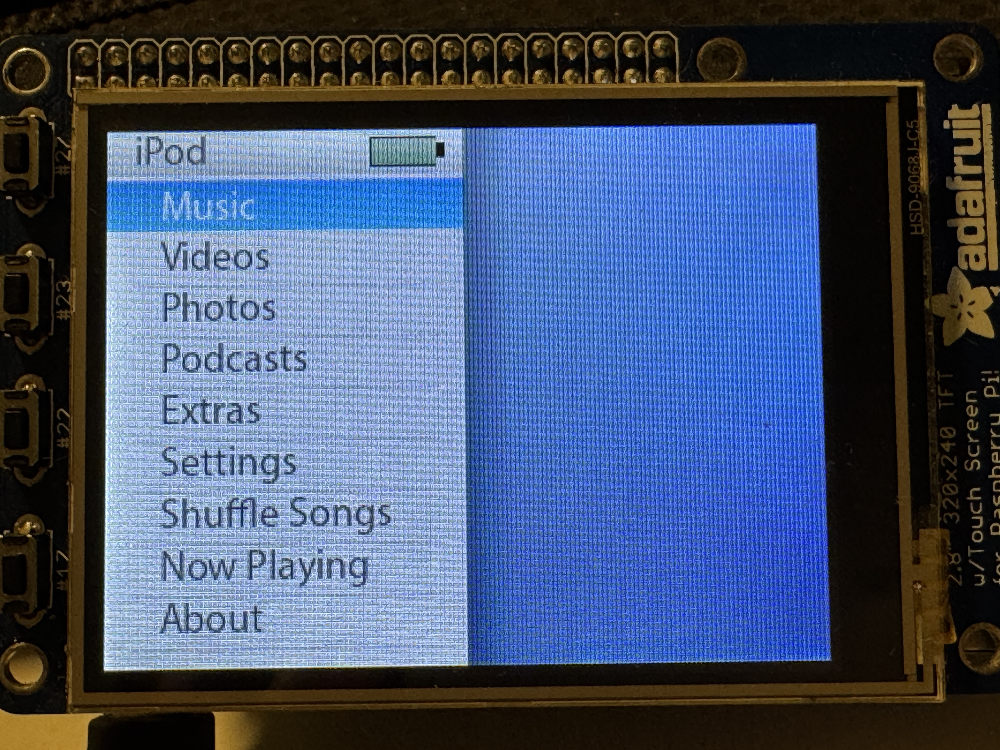
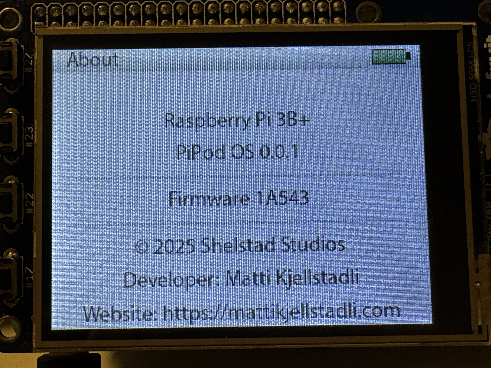

<p align="center">
  
</p>

<h1 align="center">PiPod OS</h1>

PiPod OS is a recreation of the classic iPod interface and functionality for Raspberry Pi devices.

## Status
**Pre-MVP**
Only basic functionality is implemented. The system is not yet usable.

## Features

* iPod-style menu navigation
* Music playback with album artwork
* Optional support for jellyfin music library
* More TBD...

## Tech Stack

- **Language:** C++
- **Target OS:** Raspberry Pi OS Lite  
  - While the application should run on most systems, the primary goal is for it to act as an OS frontend. Therefore, Raspberry Pi OS Lite is the main target platform.
- **Libraries / Dependencies:**
  - SDL2 (video, audio, input)
  - SDL2_ttf (font rendering)
  - SDL2_image (image loading)
  - SDL2_mixer (audio playback)
  - TagLib (MP3 metadata parsing)

## Image Gallery

Test run on Raspberry Pi 3B+, running Raspberry Pi OS 64bit Lite, with a 2.8" pitft display.





## Installation

1. Install **PiPod OS** on a fresh Raspberry Pi OS Lite system by running the installer script:

   ```bash
   git clone https://github.com/mattkje/pi-pod-os.git
   cd pi-pod-os
   sudo ./pi-pod-os-install.sh

## Usage

Navigate using the arrow keys and `Enter` to select. `Backspace` returns to the previous menu.
